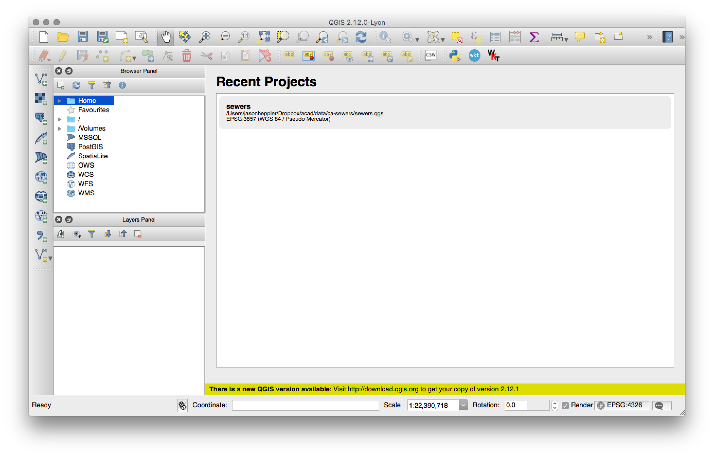
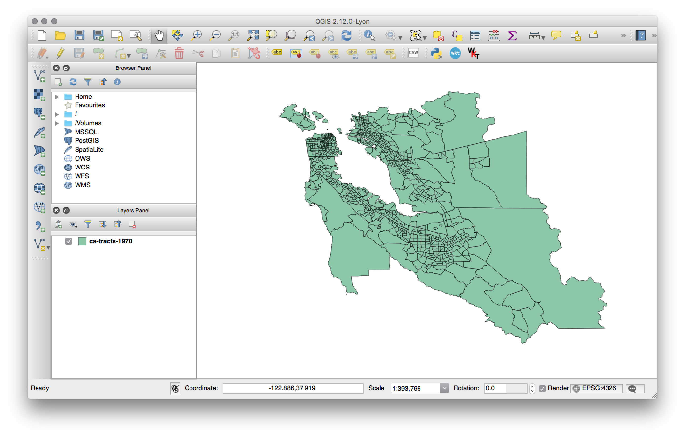
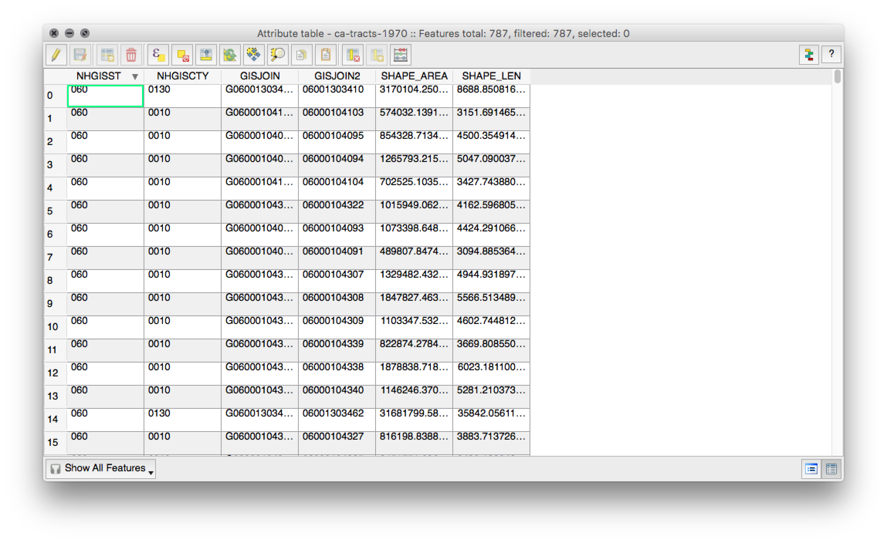
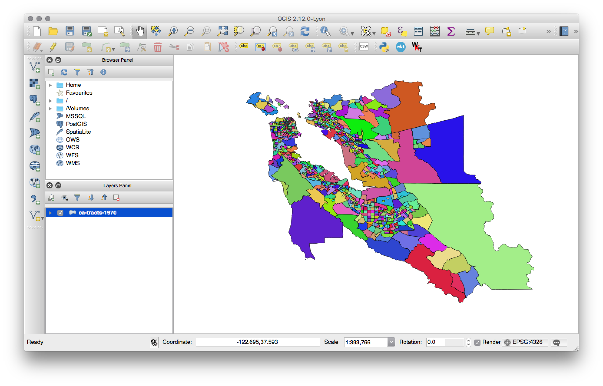
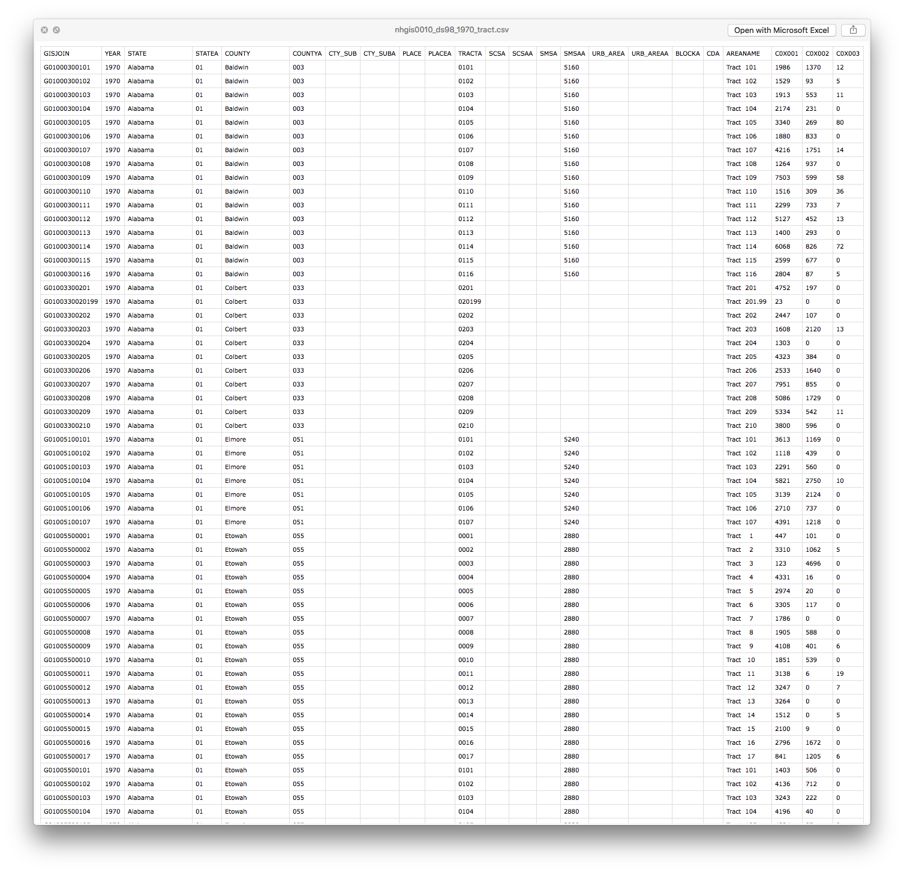
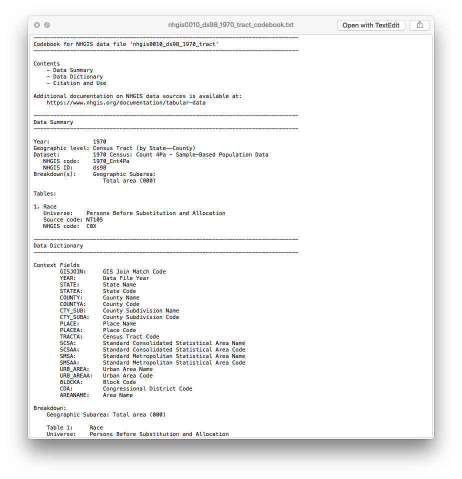

## About QGIS

QGIS is a tool for working with geographic information systems (GIS) similar to [ArcGIS](http://www.esri.com/software/arcgis/arcgis-for-desktop).^[ArcGIS is the de facto tool for most people working with GIS.] While ArcGIS is a deeply powerful tool, QGIS offers two key advantages in my mind: I like supporting open source software for scholarship and research; and QGIS does not come with the high financial burden of ArcGIS. In other words, you are free to start using and learning QGIS without much overhead.

That said, the things you learn in QGIS are broadly applicable to ArcGIS should you decide to use it instead.

### Installing QGIS

QGIS comes with installation packages for most platforms. Download the [latest version](http://www.qgis.org/en/site/forusers/download.html) (as of this writing, QGIS 2.12.1-1). **Be sure to also grab the required QDAL framework and Matplotlib module.** [QDAL](http://www.kyngchaos.com/software/frameworks#gdal_complete) and the [Matplotlib](http://www.kyngchaos.com/software/python) also both come as package installers. These must be installed before installing QGIS.

## Getting Data

We'll be using the [National Historic Geographic Information System](https://www.nhgis.org/) (NHGIS) for our historical data. THe project started under the Minnesota Population Center to digitize U.S. Census data. To download data from NHGIS, you'll need to create an account, and navigate to the [data finder]() to find and select the data you would like to download. Since we'll be linking together Census data with spatial data, make sure you download both the data as well as the shapefiles. We need to be able to match data against the geography. For example purposes, you can find data I've prepared in this repository.

## Shapefiles

The data we're working off is called a `shapefile`, but `shapefile` is a misnomer: they are actually several files, all needed for the reading of a shapefile into software that can interpret GIS. GIS requires three mandatory files, `.shp`, `.shx`, and `.dbf`. Shapefiles are a creation of Esri, which created shapefiles to allow geographic information to be shared across systems and platforms. Shapefiles represent what are called `vector` data: points, lines, and polygons. Vector data usually contains attributes as well, such as temperature, elevation, or name. We can also join attribute information that we've created, which we will cover in a minute.

Mandatory files

- `.shp` — shape format; the feature geometry itself
- `.shx` — shape index format; a positional index of the feature geometry to allow seeking forwards and backwards quickly
- `.dbf` — attribute format; columnar attributes for each shape, in dBase IV format

Other files

- `.prj` — projection format; the coordinate system and projection information, a plain text file describing the projection using well-known text format
- `.sbn` and `.sbx` — a spatial index of the features
- `.fbn` and `.fbx` — a spatial index of the features that are read-only
- `.ain` and `.aih` — an attribute index of the active fields in a table
- `.ixs` — a geocoding index for read-write datasets
- `.mxs` — a geocoding index for read-write datasets (ODB format)
- `.atx` — an attribute index for the .dbf file in the form of shapefile.columnname.atx (ArcGIS 8 and later)
- `.shp.xml` — geospatial metadata in XML format, such as ISO 19115 or other XML schema
- `.cpg` — used to specify the code page (only for .dbf) for identifying the character encoding to be used
- `.qix` — an alternative quadtree spatial index used by MapServer and GDAL/OGR software

## Adding Vector Layers

QGIS works off of layers, similar to Photoshop. Layers are defined by their type (shapefile, CSV, and so on) and will allow different activities based on the kind of file and data is included. Let's start by adding a vector layer of our Census tract shapefile:

Click "Layer > Add Layer > Add Vector Layer" in the menubar to add a new layer. You will then navigate to the directory where your shapefiles are located. When adding a shapefile, you don't need to include the required files mentioned above, only the `.shp` file itself. These other files are automatically imported into QGIS.

Once you add the layer you'll see it displayed in QGIS. You can pan and zoom with the tools in the toolbar. You can also right-click on the layer and choose "Zoom to Layer" to zoom back to the extent of the layer (useful if you zoom in too close, or accidentially send the shapefile off scene and can't locate it). You can use the "identify features" tool to click on individual tracts and see the data associated with it.

If you want to see all of the spatial data, right click on the layer and select "Open Attribute Table." You now see a spreadsheet-like table view of the spatial data.

Each row in the attribute table represents a feature in the shapefile (in this case, a row for each tract). Each of the tracts have an associated set of variables, and each variable is stored in a column. These variables can contain a range of information such as text and numeric information, as well as some spatial information such as NHGISNAM, SHAPE_AREA, and GISJOIN. Some of these are self-explanatory (such as SHAPE_AREA, the size of the tract in square meters) and some are at first glance inscrutible (such as GISJOIN). These fields are unique identifers for our census tracts, an essential feature for us to join new data to the shapefile.

We were given a random color for the tracts, and at the moment the tracts aren't really telling us much. What if, instead, we wanted to view the data within these shapefiles as a [Choropleth map]()? In QGIS, we will assign colors to the map by basing the colors off attributes in the data. Right click on the layer, and click "Properties." In the window that appears, click "Style." QGIS refers to the display of data as a "symbol," and it's here that we will change how our map is displayed. Note here that you have a fair bit of control over the display of your map: you can change the fill color of the polygons, change the border size and color, and other display attributes. These can be modified and adjusted to your liking. But we want to build a visualization based off our data, so let's let QGIS do that for us.

In the "Style" tab, you'll note a dropdown at the top. Currently selected is a "single symbol" option, but we want a "graduated" symbol for displaying race information about the Census tracts. Click the dropdown and select "graduated." The view of our window will change slightly, and we now have some new options available to us to work off the data in the attribute table. The graduated view will allow us to create a color ramp based off some data. In the "Column" dropdown, we will be presented with a list of variables from our shapefile. Select "SHAPE_AREA," feel free to change the color ramp under, then click "Classify" to put the data into our bins. Note that you have a number of options for categorizing the data (such as Jenks, quantile, and so on) as well as the ability to change the number of classes (which is defaulted to 5). Once the data is classified, click "Apply" and then "OK" to see the results of our work.

This map is what results, classifying Census tracts based off the size of the Census tract.

## Joining Data

Now, the above might be somewhat interesting if you're studying something like land use. But we want to plot more information than just what's included in the shapefile. Let's say we have some statistics about population figures in the Bay Area in 1970. Take a look at the NHGIS data file you downloaded by opening it in Excel, Numbers, Google Spreadsheets, or LibreOffice.

Notice the very first thing in our file: a column called `GISJOIN`, just like our shapefile. Again, the GISJOIN is a unique identifier for a Census tract, and we will use this key to join data to our spatial data. We get additional information as well: Census tract name, state, county, as well as a bunch of strangely named headings like `B07001`. You'll need to open up the codebook in a text editor (like Sublime Text, TextEdit, or vim) to see what these cryptic names mean. Open up the codebook `nhgis0040_1970_tract_codebook.txt` and you can find what these columns mean.

To join the data with the shapefile, we load the CSV into QGIS by selecting "Layer > Add Layer > Add Delimited Text Layer" from the menu. Navigate to the file and make sure to select "no geometry" from the file browser (since the file includes no spatial information like latitude and longitude).

Both layers are now in QGIS. Time to join them. Right click on the *shapefile* layer, select "Properties," and click the "Joins" tab. Recall that both files have a `GISJOIN` column. We'll use that column to let QGIS know what data should be linked up with what Census tracts. It's more than likely most of your historical data won't be as nicely organized as the NHGIS data. You might, for example, have to join data using different columns or create your own unique index to allow joins to be successful. What's important to remember is that each row of the CSV needs to have a corresponding unique ID that matches the shapefile ID.

Once the join is complete, you can open the shapefile's attribute table again and see new columns of data pulled from our CSV file. Now, let's create a more useful graduated symbol map. Instead of selecting `SHAPE_AREA`, let's select `B07002` (the column of African American populations), click "Apply," and click "OK" to see our handywork.

Congratulations! You just made your first geographic visualization in QGIS.

If you want to know more about what QGIS can do, check out their guide "[A Gentle Introduction to GIS](http://docs.qgis.org/2.0/en/docs/gentle_gis_introduction/)." There are many, many resources and tutorials online for using QGIS. Plus, QGIS has many techniques that you can use for spatial analysis. Make sure to check these out.

## Adding a Base Map

Sometimes we'll want to also include a base map to allow our readers a better sense of topography and geography. Luckily, QGIS makes this pretty simple with it's plugin system. We're going to add the OpenLayers plugin. Navigate to "Plugins > Manage and Install Plugins..." In the window that appears, make sure the "All" tab is selected and search for "OpenLayers." Select the "OpenLayers Plugin" and click "Install." When done, a new menubar item will appear called "Web."

So, let's add a base map to our county tracts.

## Examples of Spatial History

- [American Migrations to 1880](http://benschmidt.org/migration2/)
- [Atlantic Networks Project](https://sites.google.com/site/atlanticnetworksproject/home)
- [Atlas of the Historical Geography of the United States](http://dsl.richmond.edu/historicalatlas/)
- [Counties Blue and Red, Moving Right and Left](http://www.nytimes.com/interactive/2012/11/11/sunday-review/counties-moving.html)
- [David Rumsey Map Collection](http://www.davidrumsey.com/)
- [Digital Atlas of Roman and Medieval Civilizations](http://darmc.harvard.edu/icb/icb.do)
- [Digital Harlem](http://digitalharlem.org/)
- [Digital Harrisburg](http://digitalharrisburg.com/)
- Flowing Data: [Coffee](http://flowingdata.com/2014/03/18/coffee-place-geography/), [Pizza](http://flowingdata.com/2013/10/14/pizza-place-geography/), [Burgers](http://flowingdata.com/2014/06/24/burger-place-geography/)
- [Geography of the Post](http://cameronblevins.org/gotp/)
- [Going to the Show](http://docsouth.unc.edu/gtts/)
- [Hestia: Home for Geospatial Analysis of Herodotus's Histories](http://hestia.open.ac.uk/)
- [Hidden Florence](http://hiddenflorence.org/)
- [Histories of the National Mall](http://mallhistory.org/)
- [History Pin](https://www.historypin.org/)
- [Holocaust Geographies Collective](http://web.stanford.edu/group/spatialhistory/cgi-bin/site/project.php?id=1015)
- [How Your Hometown Affects Your Chances of Marriage](http://www.nytimes.com/interactive/2015/05/15/upshot/the-places-that-discourage-marriage-most.html?rref=upshot&abt=0002&abg=1)
- [Hypercities](http://www.hypercities.com/)
- [Locating London's Past](http://www.locatinglondon.org/)
- [A Map of Baseball Nation](http://www.nytimes.com/interactive/2014/04/24/upshot/facebook-baseball-map.html), [Baseball’s Second-Place Favorites: Go, Mets](http://www.nytimes.com/2014/04/27/upshot/there-is-one-more-baseball-map-we-love-showing-the-second-favorite-teams.html)
- [Mapping the Republic of Letters](http://republicofletters.stanford.edu/)
- [Mapping the State of the Union](http://www.theatlantic.com/features/archive/2015/01/mapping-the-state-of-the-union/384576/)
- [Mapping Texts](http://mappingtexts.org/)
- [Map of Early Modern London](http://mapoflondon.uvic.ca/index.htm)
- [Mapping Gothic France](http://mappinggothic.org/)
- [Mapping the Medieval Townscape](http://archaeologydataservice.ac.uk/archives/view/atlas_ahrb_2005/atlas.cfm)
- [Mapping Poverty in America](http://www.nytimes.com/newsgraphics/2014/01/05/poverty-map/)
- [Midterm Elections](http://www.nytimes.com/interactive/2014/11/04/upshot/senate-maps.html)
- [Murder Map](http://www.antievictionmappingproject.net/murdermap.html)
- [NYPL Map Warper](http://maps.nypl.org/warper/maps?show_warped=1)
- [Orbis](http://orbis.stanford.edu/)
- [PhilaPlace](http://www.philaplace.org/)
- [Pelagoios](http://pelagios-project.blogspot.com/)
- [Pleiades](http://pleiades.stoa.org/home)
- [Stop and Frisk is All But Gone from New York](http://www.nytimes.com/interactive/2014/09/19/nyregion/stop-and-frisk-is-all-but-gone-from-new-york.html)
- [Railroads and the Making of Modern America](http://railroads.unl.edu/)
- [Redlining Richmond](http://dsl.richmond.edu/holc/)
- Ben Schmidt, [Mapping ship logs](http://sappingattention.blogspot.com/2012/11/reading-digital-sources-case-study-in.html)
- [Spread of U.S. Slavery, 1790–1860](http://lincolnmullen.com/projects/slavery/)
- [Stanford Spatial History Project](http://web.stanford.edu/group/spatialhistory/cgi-bin/site/projects.php)
- [Travelers in the Middle East Archive](https://scholarship.rice.edu/handle/123456789/1)
- [Visualizing Emancipation](http://dsl.richmond.edu/emancipation/)

## Alternatives

- [CartoDB]()
- [Google Maps]()
- [StoryMap](https://storymap.knightlab.com/)
- [ArcGIS Online]()
